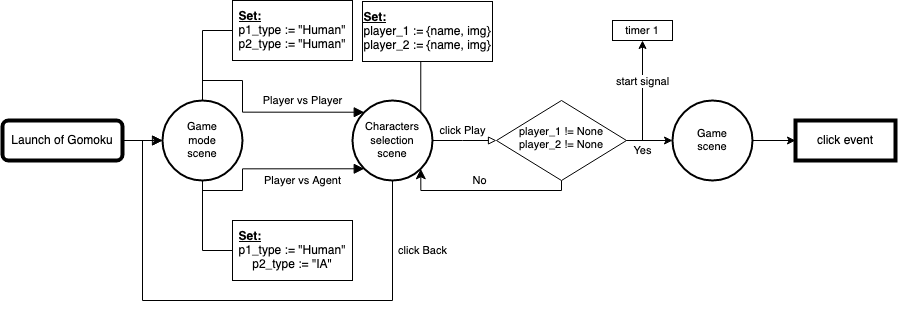
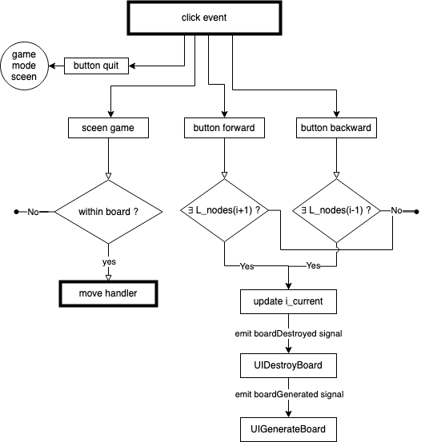
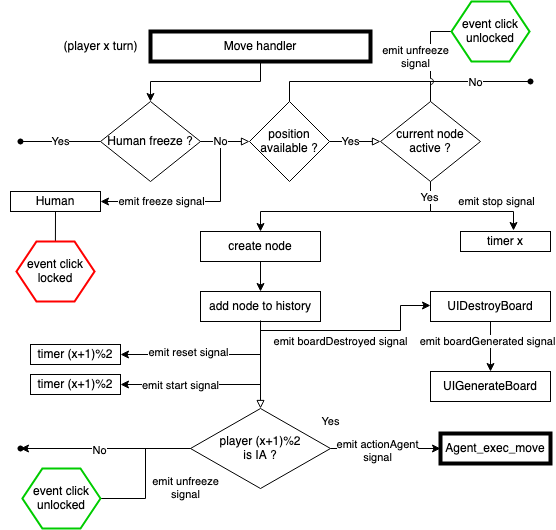

# 42_Gomoku
[42 curriculum]
Gomoku is a game which is played on Go board. The objectives of the project is to develop an agent capable to beat human player. Across the project we tackle minimax algo, heuristic function, optimization and user interface.

---
## In brief
* Create a python/ conda virtual environment (or install on your base environment, this is up to you) with at least python3.7.
	```Bash
	> python -V
	Python 3.7.4

	# With virtualenv, one could need to install the package via pip install virtualenv (again check the version of pip: pip -V)
	> python -m venv v_gomoku
	> source v_gomoku/bin/activate
	(v_gomoku) > pip install -r requirements.txt

	# Via conda:
	> conda conda create -n v_gomoku python=3.7
	> conda activate v_gomoku --file conda_requirements.txt
	```
* Create a symbolik link at the root of this repository (right after you did `cd 42_gomoku`) to link the assets:
	```Bash
	(v_gomoku) > ln -s interface/assets assets
	```
* Run the program:
	```Bash
	(v_gomoku) > python main.py
	```
* It should work, at least on Ubuntu-20.4 (my personal OS) and MacOS Mojave version 10.14.6 (42Paris OS).

---
## The game
Gomoku is a strategy board game traditionally played on a Go board.

Two players take turns placing stones of their color on an intersection of the board.
The game ends when one of the player manages to align five stones (along row, column or diagonal).

Depending of the rules, only an alignment of 5 can win or an alignement of 5 or more is okay.
In the context of this projet, we will consider 5 or more to be a win.

There are different interpretations on what the board size for Gomoku should be,
here for this project we will be played on a 19x19 Goban, without limit to the number of stones.

In the context of this project, you will play with the following additional rules :
* Capture (As in the Ninuki-renju or Pente variants):
  An opponent's pair is removed by flanking them with your own stones (See the appendix).
  This rule adds a win condition : If you manage to capture ten of your opponent’s stones, you win the game.
* Game-ending capture:
  An alignement of five stones not breackable by an opponent's capture. Despite one can aligned 5 stones, if the opponent is able to capture a fifth pair of stones, among the stones of the alignement or not, the oppponent wins the game by capture.
  There is no need for the game to go on if there is no possibility of this happening.
* No double-threes : It is forbidden to play a move that introduces two free-three alignments, which would guarantee a win by alignment (See the appendix).

See ```gomoku.pdf``` file in the folder **[doc_assets](https://github.com/madvid/42_Gomoku/tree/master/doc_assets)** for more details about the game, what is expected and details about capture.

---
## Algorithm Minmax and its variants:
### Minimax
🚧 ... redaction pending ...🚧

### minimax_ab
🚧 ... redaction pending ...🚧
### minimax_ab_tt
🚧 ... redaction pending ...🚧

### negamax
🚧 ... redaction pending ...🚧
---
## User interface:
### PyQt5
🚧 ... redaction pending ...🚧

### Signals, Slots, Events Queue:
🚧 ... redaction pending ...🚧

---
## Functional and relational programs unit:
Here I will detailed how the program works
### From launch of Gomoku to the start of the game
🚧 ... redaction pending ...🚧


### Outside the board game zone
🚧 ... redaction pending ...🚧


### Inside the board game zone
🚧 ... redaction pending ...🚧



----
### Authors:
* [Pierre Peigne](https://github.com/ppeigne)
* [Matthieu David](https://github.com/madvid)